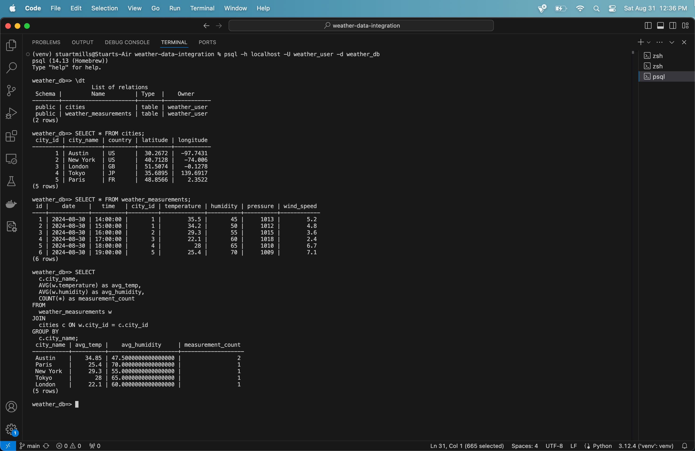
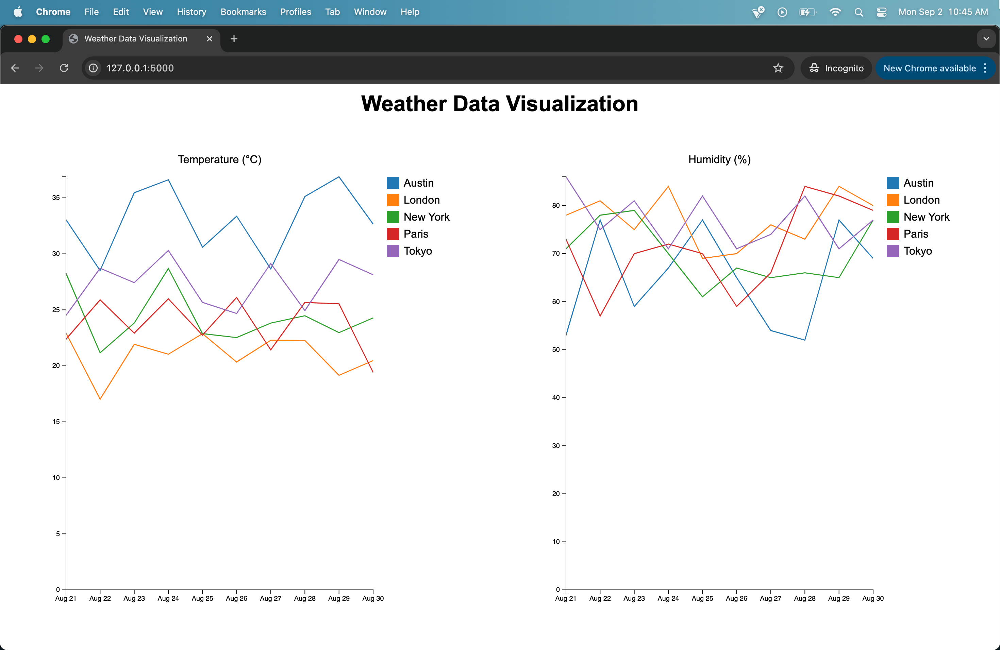

# Weather Data Integration Pipeline

This project simulates the integration of a third-party reporting tool (OpenWeatherMap API) with a data system. It includes an end-to-end ETL pipeline that extracts weather data, transforms it using Apache Spark, and loads it into a PostgreSQL database.

## Project Overview

The Weather Data Integration Project demonstrates key data engineering skills by creating a pipeline that:

1. Extracts weather data from the OpenWeatherMap API
2. Transforms the raw data using Apache Spark to fit a designed star schema
3. Loads the processed data into a PostgreSQL database
4. Orchestrates the entire ETL process using Apache Airflow

## Features

- API data extraction using the Requests library
- Big data transformation using Apache Spark
- Data loading into PostgreSQL using Spark JDBC
- ETL workflow orchestration with Apache Airflow
- Error handling and logging
- Unit testing for each component

## Tech Stack

- Python 3.8+
- Apache Spark 3.1.2
- PostgreSQL
- Apache Airflow
- PySpark
- Requests
- Flask

## Data Model

The project uses a star schema with the following structure:

1. Fact Table: `weather_measurements`
   - date
   - city_id (foreign key to cities dimension)
   - temperature
   - humidity
   - pressure
   - wind_speed

2. Dimension Tables:
   - `cities`
     - city_id
     - city_name
     - country
     - latitude
     - longitude

## Database Result

## Data Visualization

## Technical Summary

This project demonstrates key data engineering concepts and tools. It uses Python for scripting, with libraries such as Requests for API interaction and Apache Spark for big data processing. The ETL process is orchestrated using Apache Airflow, allowing for scheduled, repeatable workflows. Data is stored in a PostgreSQL database, interfaced with Spark for efficient data loading. The project structure follows best practices with separate modules for extraction (api_client.py), transformation (data_transformer.py), and loading (data_loader.py). Error handling, logging, and unit testing are implemented throughout to ensure robustness and reliability. Environment variables are used for configuration management, adhering to security best practices. For data visualization, a Flask web app utilizes SQLAlchemy and Pandas to query and serve weather data from the database. This architecture demonstrates scalability and maintainability, key aspects of production-grade data engineering solutions, particularly in big data environments.
